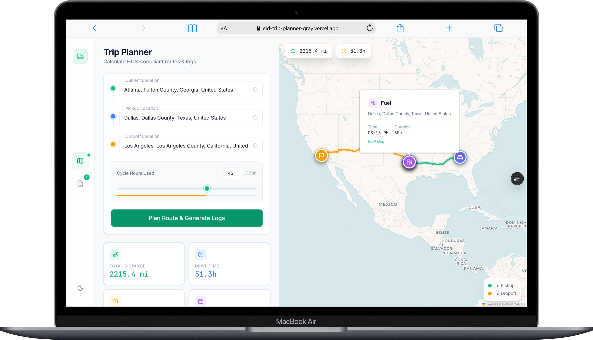
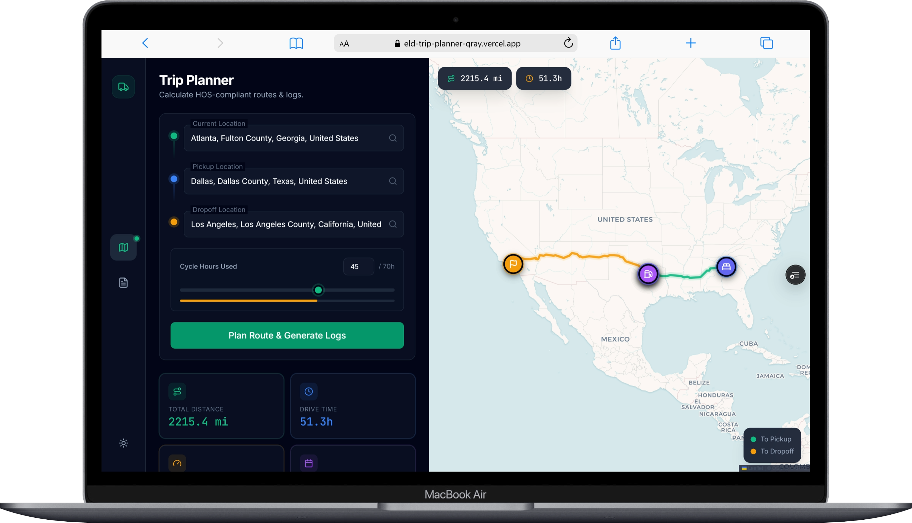
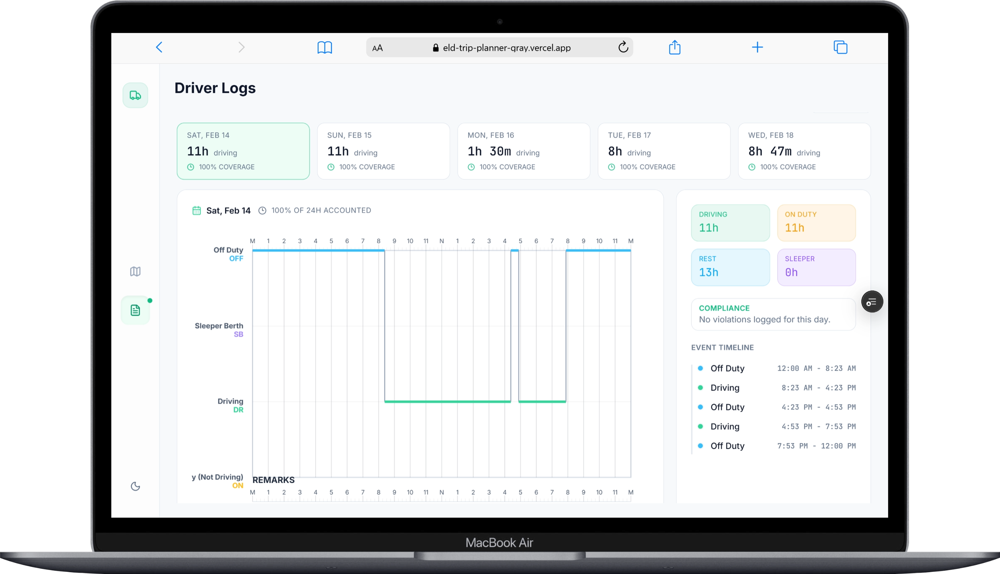

# 🚛 ELD Compliance Simulator

### Intelligent Trip Planning with FMCSA Hours-of-Service Compliance

<p align="center">
  
</p>

<p align="center">
  <strong>A full-stack application that plans truck routes and auto-generates legally compliant ELD daily log sheets.</strong><br>
  Enter your trip details → get an optimized HOS-compliant schedule → view FMCSA driver logs for every day of the trip.
</p>

<p align="center">
  
  
  
  
  
  
</p>

---

## 📸 Screenshots

<table>
  <tr>
    <td width="50%">
      
      <p align="center"><strong>🌙 Trip Planner — Dark Mode</strong><br><em>Route visualization with stop markers, fuel pumps, and summary stats</em></p>
    </td>
    <td width="50%">
      
      <p align="center"><strong>☀️ Trip Planner — Light Mode</strong><br><em>Location autocomplete, cycle hours slider, and route geometry</em></p>
    </td>
  </tr>
  <tr>
    <td colspan="2">
      
      <p align="center"><strong>📋 FMCSA Driver Daily Logs</strong><br><em>Canvas-rendered 24-hour grid with Off Duty, Sleeper Berth, Driving, and On Duty rows — interactive hover tooltips and event timeline</em></p>
    </td>
  </tr>
</table>

---

## ✨ Features

<table>
  <tr>
    <td width="50%">

### 🗺️ Trip Planning
- **Interactive route map** with Leaflet + real road polylines
- **Location autocomplete** via Nominatim (OpenStreetMap)
- **Multi-leg routing** — Current → Pickup → Dropoff
- **Fuel stop markers** auto-placed every 1,000 miles
- **HGV-profile routing** via OpenRouteService (truck-legal roads)

### 📊 HOS Compliance Engine
- ⏱️ 11-hour driving limit per shift
- 🕐 14-hour duty window tracking
- ☕ 30-min break after 8h continuous driving
- 😴 10-hour off-duty rest to reset shift
- � 70-hour/8-day cycle with 34-hour restart
- 🔄 Cycle hours input for accurate planning

</td>
<td width="50%">

### 📝 ELD Daily Log Sheets
- **Canvas-rendered FMCSA grids** — pixel-perfect, print-ready
- **Multi-day logs** with automatic midnight splitting
- **Interactive hover tooltips** with event details
- **Remarks section** with time-linked annotations
- **Daily summary** — driving, rest, compliance status
- **Print support** — one-click export

### 🎨 UI/UX
- 🌗 Dark & Light mode with smooth transitions
- 📱 Fully responsive design
- ✨ Framer Motion page animations
- 🔔 Smart "Logs Ready" notification + badge
- � Type-ahead location suggestions

</td>
  </tr>
</table>

---

## 🏗️ Architecture

```
┌─────────────────────────────────────────────────────────────────┐
│                     FRONTEND (React 19 + Vite 7)                │
│                                                                 │
│  ┌──────────┐   ┌──────────────┐   ┌────────────────────────┐   │
│  │ TripForm │──▶│LocationInput │   │     RouteMap           │   │
│  │          │   │(Autocomplete)│   │ (Leaflet + Polylines   │   │
│  │          │   └──────────────┘   │  + Stop Markers)       │   │
│  └────┬─────┘                      └────────────────────────┘   │
│       │                                                         │
│       ▼                                                         │
│  ┌──────────────────────────────────────────────────────────┐   │
│  │  LogSheet (Canvas-rendered FMCSA grid + Event Timeline)  │   │
│  └──────────────────────────────────────────────────────────┘   │
└───────────────────────────┬─────────────────────────────────────┘
                            │ REST API (Axios + Proxy)
                            ▼
┌─────────────────────────────────────────────────────────────────┐
│                  BACKEND (Django 4.2 + DRF)                     │
│                                                                 │
│  /api/plan-trip/                                                │
│  ┌──────────┐  ┌──────────┐  ┌──────────────┐  ┌────────────┐  │
│  │ Geocoder │─▶│  Router  │─▶│HOS Simulator │─▶│Log Builder │  │
│  │Nominatim │  │   ORS    │  │(TripSimulator│  │(Daily Logs)│  │
│  └──────────┘  └──────────┘  │ State Machine│  └────────────┘  │
│                               └──────────────┘                  │
│  /api/suggest/                                                  │
│  ┌───────────────────────┐                                      │
│  │ Autocomplete Service  │                                      │
│  │   (Nominatim + Rate   │                                      │
│  │    Limiting)          │                                      │
│  └───────────────────────┘                                      │
└─────────────────────────────────────────────────────────────────┘
```

---

## 📜 FMCSA HOS Rules Implemented

Based on the **Interstate Truck Driver's Guide to HOS (FMCSA-HOS-395)** for property-carrying drivers under the 70-hour/8-day rule:

| Rule                | Limit                       | What Happens                     |
| ------------------- | --------------------------- | -------------------------------- |
| **Driving Limit**   | 11 hours per shift          | Driver stops, 10h rest triggered |
| **Duty Window**     | 14 hours from first on-duty | Cannot drive after window closes |
| **Mandatory Break** | 30 min after 8h driving     | Auto-inserted break              |
| **Off-Duty Rest**   | 10 hours minimum            | Resets shift counters            |
| **Cycle Limit**     | 70 hours / 8 days           | All on-duty time counted         |
| **Cycle Restart**   | 34 consecutive hours off    | Full cycle reset to 0            |
| **Fuel Stops**      | Every 1,000 miles           | 30-min on-duty stop              |
| **Pickup/Dropoff**  | 1 hour each                 | On-duty (not driving)            |

### Assumptions
- Property-carrying driver, interstate
- 70-hour/8-day cycle (no adverse conditions)
- Average speed: **55 MPH**
- Fueling at least once every 1,000 miles

### Example Verification — Atlanta → Dallas → Los Angeles (45h cycle)

```
Day 1 (Sat):  11h driving + 30m break     → Cycle: 45 + 11   = 56h
Day 2 (Sun):  11h driving + 1h pickup     → Cycle: 56 + 12.5 = 68.5h
              + 30m fuel stop
Day 3 (Mon):  1h 30m driving → CYCLE HITS 70h → 34-HOUR RESTART BEGINS
Day 4 (Tue):  Restart ends at 3:53 PM (exactly 34h later) → 8h driving
Day 5 (Wed):  8h 47m driving → DELIVERED IN LA

Total driving: 40.3h × 55 mph = 2,215 miles ✅
```

---

## 🛠️ Tech Stack

| Layer          | Technology              | Purpose                               |
| -------------- | ----------------------- | ------------------------------------- |
| **Frontend**   | React 19, Vite 7        | UI framework & build tool             |
| **Styling**    | Tailwind CSS 4          | Utility-first CSS framework           |
| **Animations** | Framer Motion           | Page transitions & micro-interactions |
| **Maps**       | Leaflet + React-Leaflet | Interactive route visualization       |
| **HTTP**       | Axios                   | API communication with proxy          |
| **Backend**    | Django 4.2, DRF 3.15    | REST API & business logic             |
| **Geocoding**  | Nominatim (OSM)         | Free address → coordinate conversion  |
| **Routing**    | OpenRouteService (HGV)  | Truck distance, duration & geometry   |
| **Deployment** | Docker, Render          | Cloud hosting                         |

---

## 🚀 Getting Started

### Prerequisites
- **Node.js** 18+ and **npm**
- **Python** 3.11+
- **OpenRouteService API Key** — [Get one free](https://openrouteservice.org/dev/#/signup)

### 1. Clone the Repository

```bash
git clone https://github.com/princesinghrajput/ELD-trip-planner.git
cd ELD-trip-planner
```

### 2. Backend Setup

```bash
cd server

# Create & activate virtual environment
python -m venv .venv
# Windows:
.venv\Scripts\activate
# macOS/Linux:
source .venv/bin/activate

# Install dependencies
pip install -r requirements.txt

# Configure environment
cp .env.example .env
# Edit .env → add your OPENROUTESERVICE_API_KEY

# Run migrations & start server
python manage.py migrate
python manage.py runserver
```

### 3. Frontend Setup

```bash
cd frontend

# Install dependencies
npm install

# Start dev server (proxies API to Django)
npm run dev
```

Open **http://localhost:5173** — the app is ready!

### Environment Variables

Create `server/.env`:
```env
OPENROUTESERVICE_API_KEY=your_ors_api_key_here
DJANGO_SECRET_KEY=your_secret_key_here
DEBUG=True
ALLOWED_HOSTS=localhost,127.0.0.1
```

---

## 📡 API Reference

### `POST /api/plan-trip/`

Plan a complete HOS-compliant trip.

**Request:**
```json
{
  "current_location": "Atlanta, Fulton County, Georgia, United States",
  "pickup_location": "Dallas, Dallas County, Texas, United States",
  "dropoff_location": "Los Angeles, Los Angeles County, California, United States",
  "cycle_used": 45
}
```

**Response:**
```json
{
  "route": {
    "legs": [
      { "from": "Atlanta...", "to": "Dallas...", "distance_miles": 781.2, "geometry": [...] },
      { "from": "Dallas...", "to": "Los Angeles...", "distance_miles": 1434.2, "geometry": [...] }
    ],
    "total_distance_miles": 2215.4,
    "total_duration_hours": 51.3
  },
  "timeline": [ ... ],
  "daily_logs": [
    {
      "date": "2026-02-14",
      "segments": [ { "status": "D", "start_hour": 8.38, "end_hour": 16.38 }, ... ],
      "totals": { "OFF": 13.0, "D": 11.0, "ON": 0.0, "SB": 0.0 },
      "remarks": [ { "time": "16:23", "note": "30-minute break" } ]
    }
  ],
  "stops": [ ... ],
  "summary": { "total_days": 5, "total_driving_miles": 2215.4 }
}
```

### `GET /api/suggest/?q=<query>`

Location autocomplete suggestions.

```json
[
  { "label": "Atlanta, Fulton County, Georgia, United States", "lat": "33.749", "lng": "-84.388" },
  { "label": "Atlanta, Texas, United States", "lat": "33.113", "lng": "-94.164" }
]
```

---

## 📂 Project Structure

```
ELD-compliance-simulator/
│
├── frontend/                        # React + Vite + Tailwind
│   ├── src/
│   │   ├── api/client.js            # Axios client with proxy
│   │   ├── components/
│   │   │   ├── ui/
│   │   │   │   ├── Button.jsx       # Reusable button
│   │   │   │   ├── Input.jsx        # Floating-label input
│   │   │   │   └── LocationInput.jsx # Autocomplete input
│   │   │   ├── TripForm.jsx         # Trip planning form
│   │   │   ├── RouteMap.jsx         # Leaflet map + markers
│   │   │   └── LogSheet.jsx         # Canvas FMCSA grid (900+ lines)
│   │   ├── hooks/
│   │   │   ├── useTheme.js          # Dark/light mode
│   │   │   └── useTripPlanner.js    # Trip API hook
│   │   ├── App.jsx                  # Main app + tab navigation
│   │   └── index.css                # Global styles + themes
│   ├── vite.config.js               # Vite + API proxy config
│   └── package.json
│
├── server/                          # Django REST Framework
│   ├── config/
│   │   ├── settings.py              # Django configuration
│   │   └── urls.py                  # Root URL routing
│   ├── trip/
│   │   ├── services/
│   │   │   ├── constants.py         # FMCSA HOS constants
│   │   │   ├── geocoding.py         # Nominatim geocoder
│   │   │   ├── autocomplete.py      # Location suggestions
│   │   │   ├── routing.py           # OpenRouteService client
│   │   │   ├── hos_calculator.py    # HOS state machine engine
│   │   │   ├── log_builder.py       # Timeline → daily logs
│   │   │   └── trip_planner.py      # Orchestrator pipeline
│   │   ├── serializers.py           # DRF request validation
│   │   ├── views.py                 # API endpoints
│   │   └── urls.py                  # Trip URL patterns
│   ├── Dockerfile                   # Container config
│   ├── docker-compose.yml           # Dev orchestration
│   └── requirements.txt             # Python dependencies
│
└── docs/
    ├── screenshots/                 # App screenshots
    ├── VIDEO_SCRIPT.md              # Demo video script
    └── assessment.md                # Original requirements
```

---

## 🎬 Video Demo

A 5–8 minute walkthrough demonstrating:
1. **Location autocomplete** — real Nominatim suggestions
2. **Cross-country trip** — Atlanta → Dallas → LA (2,215 mi)
3. **34-hour restart** — cycle exhaustion at 70 hours
4. **Canvas-rendered logs** — FMCSA grid with hover tooltips
5. **Code architecture** — HOS simulator, log builder, routing

---

## 👨‍💻 Author

**Prince Singh Rajput**

- 🌐 Website: [princecodes.com](https://princecodes.com)
- 🐙 GitHub: [@princesinghrajput](https://github.com/princesinghrajput)
- 📧 Email: hello@princecodes.com

---

<p align="center">
  <sub>Built as a technical assessment • All FMCSA rules based on the Interstate Truck Driver's Guide to HOS (FMCSA-HOS-395)</sub>
</p>
